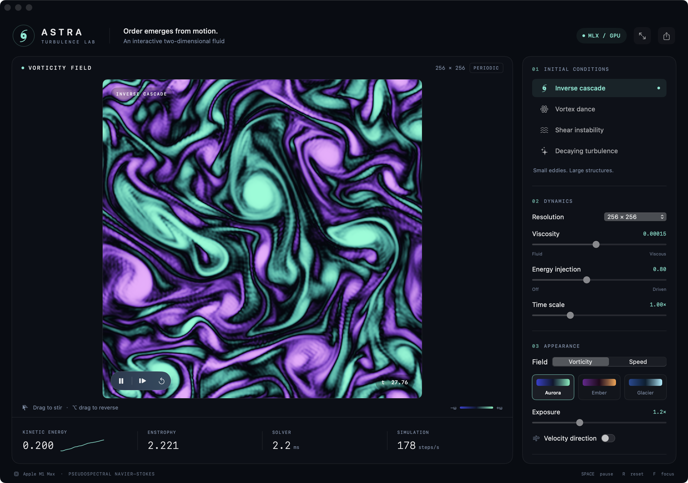

# MLX Astra

A native macOS laboratory for two-dimensional turbulence, built for Apple silicon.
MLX evolves an incompressible fluid on the GPU; a custom Metal renderer reveals
its vorticity, eddies, and velocity field in an interactive SwiftUI workspace.



## Run

1. Open **`MLXAstra.xcodeproj`** in Xcode.
2. Select the **MLXAstra** scheme and **My Mac**.
3. Run with **⌘R**. The shared scheme uses Release optimization for interactive speed.

Requires an Apple silicon Mac, macOS 14 or later, and Xcode with the Metal compiler
component installed. Built and tested with Xcode 26.3 on an M1 Max.
Xcode resolves the official [`mlx-swift`](https://github.com/ml-explore/mlx-swift)
package automatically. Its version is pinned to **0.30.6** for reproducible builds
with the installed Swift toolchain. First builds need GitHub access and take longer
while MLX and its Metal shaders compile. No Python runtime, server, model weights,
or additional application is required.

Command-line build and launch:

```sh
bash Scripts/build.sh
open /tmp/MLXAstraDerived/Build/Products/Release/MLXAstra.app
```

Scripts place build products in `/tmp/MLXAstraDerived` to keep iCloud Desktop
metadata out of signed app bundles. Set `ASTRA_DERIVED_DATA` to override that path.
Xcode's normal Derived Data location also works. Keep build products outside synced
Desktop/Documents folders if signing reports “resource fork, Finder information,
or similar detritus not allowed.”

## Explore

The app opens at **512²** with the **Ember** palette.

- **Initial conditions:** inverse cascade, vortex dance, shear instability, and decaying turbulence.
- **Drag** to add a positive vortex; **Option-drag or right-drag** reverses its spin.
- Adjust brush radius, viscosity, energy injection, time scale, and resolution live.
- Choose **128², 256², 384², 512², 1024², 2048², or 4096²** grids. A resolution or preset change restarts the flow.
- **Show every** selects 1, 2, 5, 10, 20, or 50 steps between prepared fields; the default is 10. Batches shorten automatically to keep controls responsive, and display refresh remains independent.
- **Aurora, Ember, and Glacier** palettes show signed vorticity or speed. Exposure adjusts contrast.
- **Velocity direction** traces short streamlines through the actual instantaneous velocity field.
- Live kinetic energy, enstrophy, mean time per step, steps per wall-clock second, and energy history track the simulation.

| Action | Shortcut |
| --- | --- |
| Pause / resume | Space |
| Advance exactly one step | → |
| Reset the current flow | R |
| Focus mode / show controls | F |
| Save a PNG of the field | ⌘S |

A paused flow can still be edited with the vortex brush. PNG export renders the
current field and palette at 1800 × 1800, without interface controls or the brush
cursor. The Help menu explains the controls and numerical model.

## Physics and performance

The solver advances the dimensionless vorticity equation on a periodic
`[0, 2π) × [0, 2π)` domain:

```text
∂t ω + u ∂x ω + v ∂y ω = ν Δω + f
−Δψ = ω,     u = ∂y ψ,     v = −∂x ψ
```

Real FFTs recover velocity and vorticity gradients. A strict 2/3 spectral filter
removes aliased nonlinear modes and the zero mode. A third-order integrating-factor
Runge–Kutta method handles advection, with exact exponential treatment of viscous
diffusion. The adaptive CFL bound limits the timestep as velocity or resolution
increases. Time scale changes the desired timestep; it cannot exceed that bound.

Energy injection drives a time-varying small-scale Fourier pattern. Decaying
turbulence starts with injection disabled; setting injection to zero makes any
preset unforced. Vortex impulses wrap across both periodic boundaries and have
zero spatial mean. This is an exploratory two-dimensional periodic model, without
walls or a three-dimensional turbulence closure.

MLX compiles the CFL calculation and Runge–Kutta stages into GPU graphs. Spectra
use `[kx, ky]` storage so inverse transforms avoid extra full-grid transpose copies.
Each completed integration step retires its graph, allowing large FFT buffers to
be reused; scalar time, step count, and physical diagnostics are read once per batch.

Simulation work runs continuously on one serial background queue with at most one
batch in flight. Completing a batch starts the next without waiting for a display
tick. **Show every** caps the batch at the selected number of steps, while an
adaptive 40 ms budget shortens batches when needed. At least one step runs per
batch, even when a large grid takes longer than the budget. Paused single-step
commands always advance once. Pausing, hiding, or minimizing stops new integration
work after the current batch finishes.

Evaluated MLX arrays pass to Metal through shared-memory buffers without copying
the grid to a Swift array. Frames retain those allocations until rendering completes.
Rendering happens on demand with at most two GPU frames in flight and field updates
limited to 60 Hz. PNG export performs one explicit image readback.

The reusable allocation cache adapts to resolution: 128 MiB through 512²,
512 MiB at 1024², 2 GiB at 2048², and 4 GiB at 4096². The limit is also bounded
by one eighth of physical memory. Live solver allocations are separate from this
cache, so its limit is not a cap on total GPU memory use.

**Simulation · steps/s** counts actual integration steps divided by elapsed
wall-clock seconds, independently of display refresh. **Solver · ms** shows mean
time per integration step, amortizing each batch’s field snapshot. Larger grids,
strong brush impulses, and other GPU workloads can lower the achieved rate.

Measured on this M1 Max in Release, using decaying turbulence and the shipping
solver plus shared-memory GPU-buffer handoff:

| Grid | Mean step | 95th percentile | Steps/s | Peak active MLX memory |
| --- | --- | --- | --- | --- |
| 1024² | 2.80 ms | 2.90 ms | 357.2 | 344.6 MiB |
| 2048² | 9.83 ms | 10.00 ms | 101.8 | 1,377.0 MiB |
| 4096² | 45.16 ms | 47.16 ms | 22.1 | 3,585.3 MiB |

These runs measured 300/100/30 steps after 30/20/5 warmup steps, with batches of
10/10/5, respectively. The 4096² check also exported a PNG from the full GPU field.
All remained finite. A separate forced cascade run at 512² completed 3,000 steps
after 30 warmup steps, using batches of 10: **845.5 steps/s**, 1.18 ms mean,
1.28 ms 95th percentile, and 86.5 MiB peak active MLX allocation.

The live 1024² decaying flow with **Show every 10** reported **349.2 steps/s**,
about ten times the earlier 34 steps/s display. Its control check passed pause,
single-step, reset, and paused brushing. The separately observed rate was
330.3 steps/s over a window that also included waiting for pause to settle.

Benchmark means divide measured wall time by integration steps; percentile values
use each batch’s amortized time per step. Warmup and the display compositor are
excluded. These local measurements describe solver throughput, not displayed frame
rates; the larger-grid runs are short performance and stability checks.

## Verify

```sh
bash Scripts/test.sh
open -n -W --stdout /tmp/astra-live-check.json --stderr /tmp/astra-live-check.log \
  /tmp/MLXAstraDerived/Build/Products/Release/MLXAstra.app \
  --args --live-check --grid 1024 --preset decaying --batch 10
cat /tmp/astra-live-check.json
bash Scripts/benchmark.sh --grid 1024 --preset decaying --steps 300 --warmup 30 --batch 10
bash Scripts/benchmark.sh --grid 2048 --preset decaying --steps 100 --warmup 20 --batch 10
bash Scripts/benchmark.sh --grid 4096 --preset decaying --steps 30 --warmup 5 --batch 5 --export /tmp/astra-4096.png
bash Scripts/benchmark.sh --grid 512 --steps 3000 --warmup 30 --batch 10
bash Scripts/benchmark.sh --preset vortexDance --steps 240 --export /tmp/astra-vortices.png
```

The live check opens a test window and exercises batched throughput, pause,
exactly one step, reset, and brushing while paused through the actual application
worker. The command above waits for its test instance to close, then prints the
captured JSON report.

The seven numerical tests verify analytic Fourier-mode diffusion, velocity divergence
and curl, inviscid energy/enstrophy conservation with nontrivial advection, periodic
vortex injection, strict dealiasing on a grid divisible by three, and deterministic
finite evolution of every preset. A forced-flow regression also verifies that
batched and single-step evolution agree and that updated controls reach compiled
GPU steps. GPU tests require access to Metal and should be
run through Xcode or `Scripts/test.sh`; plain `swift test` is not the build path for
this native Xcode app.

The benchmark executes the shipping solver and GPU-buffer handoff without UI
pacing. `--batch` selects 1–50 steps per snapshot and defaults to 10; unlike the
interactive runner, this benchmark uses the requested batch size without a time
budget. `--cache-mb` optionally overrides the adaptive cache limit in MiB for
allocation-cache comparisons. JSON output includes throughput, mean and
95th-percentile amortized step time, physical diagnostics, and MLX allocation
statistics. It excludes warmup and does not measure the display compositor.
`--export` also validates the shipping Metal pipeline and writes a PNG.

## Source map

- `Sources/MLXAstraCore/`: simulation parameters, presets, and MLX solver.
- `Sources/MLXAstra/`: app lifecycle, background worker, SwiftUI interface, Metal rendering, and diagnostics.
- `Tests/MLXAstraTests/`: numerical regression tests.
- `Resources/`: app metadata and native vector-derived icon assets.
- `Scripts/`: build, test, benchmark, and asset/project generation.

`MLXAstra.xcodeproj` is checked in and needs no project generator to open. After
changing the file list, update and run `python3 Scripts/generate_project.py` to
regenerate it without external tooling.
